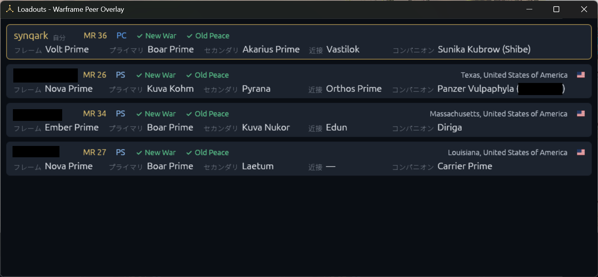
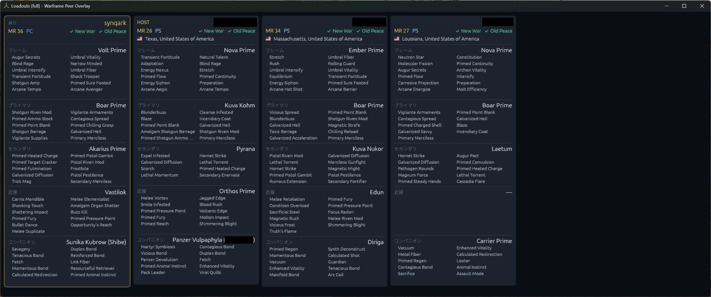

# Warframe Peer Overlay

Windows上でWarframeの分隊ピア情報を表示するオーバーレイです。

## 免責事項

**本ソフトウェアは無保証で提供されます。本ソフトウェアの使用または使用不能によって生じたいかなる損害・不利益・トラブルについても、作者は一切の責任を負いません。すべて自己責任でご利用ください。**

本プロジェクトは非公式であり、Digital Extremes Ltd. および Warframe とは一切関係がありません。同社から提携・承認・後援・支持を受けたものではありません。Warframe は Digital Extremes Ltd. の商標または登録商標です。

本ソフトウェアはゲームへの介入を行いません。Warframeが自ら出力するログファイル (`EE.log`) の読み取り、オーバーレイ位置合わせのためのウィンドウ位置の取得、ロードアウトを取得するためのゲームプロセスのメモリの読み取りを行います。メモリへのアクセスは読み取り専用で、ゲームクライアントの改変、メモリへの書き込み、プロセスへのインジェクション、通信の傍受はいずれも行いません。ただし、読み取り専用であってもゲームのメモリを読む行為を含め、利用がゲームの利用規約に抵触しないかについてはご自身でご判断ください。

## 機能

- `Warframe.x64.exe` / `Warframe.exe` の起動検出
- `%LOCALAPPDATA%\Warframe\EE.log` の追尾
- 分隊メンバー、接続先IP、ホスト候補の表示
[](assets/readme_overlay.png)
- 国・地域・ASN表示と、リレー/VPNの可能性があるホスティングASNの表示
- 分隊メンバーと自分自身のロードアウト（フレームと武器、そのMOD・フォーマ・レベル、コンパニオン、ギアなど）のJSON保存。自分の分も分隊メンバーの分も、アーセナルで装備を変えるたびに更新
- ロードアウトウィンドウ: 自分と分隊メンバーのロードアウトを1人1枚のカードで縦に並べて表示（名前・マスタリーランク・プラットフォーム・The New War / The Old Peace のクリア状況・接続元の地域と国旗と、フレーム・プライマリ・セカンダリ・近接・コンパニオン）
[](assets/readme_loadout.png)
- ロードアウトウィンドウ（full）: 同じ内容を1人1枚の縦長カードで横に並べ、各装備に搭載しているMODも一覧表示
[](assets/readme_loadout_full.png)
- ロードアウトウィンドウ（6grid）: 6人分の枠を3×2に並べ、各カードのヘッダは3列で、左にHOST/自分・MR・プラットフォーム、中央に名前（2行分の大きさ）、右に地域と国名＋国旗。その下にフレーム/プライマリ・セカンダリ/近接・コンパニオン/その他の2列でMODを表示。その他の列には、オーラ、オペレーター（または漂流者）のフォーカス、New War/Old Peaceのクリア状況を表示。カードとその中身はウィンドウの大きさに合わせて伸縮し、空いている枠は「未参加」と表示
- Historyウィンドウ: 過去に分隊を組んだプレイヤーを新しい順に一覧表示（名前・MR・プラットフォーム・国旗・マッチ時刻）。選ぶと当時のロードアウトをfullと同じカードで表示
- Loadouts・Loadouts (full)・Loadouts (6grid) の各ウィンドウでは、カードを右クリックするとそのプレイヤーのロードアウトJSON全体（画面に出していない情報も含む）をクリップボードへコピー
- 表示言語の切り替え（日本語 / English、初期設定はEnglish）。タスクトレイの `Language` から選ぶと、選んだ言語で自動的に起動し直します

## 使い方

[Releases](https://github.com/synqark/warframe-peer-overlay/releases) から `warframe-peer-overlay.exe` をダウンロードして実行してください。インストールは不要です。

オーバーレイは常にゲーム入力を透過し、タスクバーには表示されません。releaseビルドではコマンドプロンプトも表示されません。終了するには、Windowsのタスクトレイにあるアイコンを右クリックし、`Exit` を選択してください。

ロードアウトウィンドウは、同じメニューの `Loadouts` で開きます。過去に分隊を組んだプレイヤーは `History` で見られます。各装備のMODまで見る場合は `Loadouts (full)` を選びます（1440幅で4人分が横に並びます）。6人分を1画面に収めたい場合は `Loadouts (6grid)` を選びます（Full HDのモニタに全体表示する想定で、ウィンドウの大きさに合わせてカードが伸縮します）。それぞれ別のウィンドウなので、同時に開いておけます。オーバーレイと違って通常のウィンドウなので、ゲームの外や別のモニタへ移動・リサイズできます。閉じても非表示になるだけで、次に開くと同じ位置に戻ります。ウィンドウの位置と大きさは終了後も記憶し、次回の起動時に同じ場所へ開きます。自分のカードは常に一番上に表示され、分隊メンバーのカードは参加すると加わり、抜けると消えます。分隊メンバーが参加後にアーセナルで装備を変えた場合も、数秒〜10秒ほどで変更後のロードアウトに切り替わります。


[](assets/readme_tray.png)


表示言語は、同じメニューの `Language` から `日本語` と `English` のどちらかを選びます。初期設定は `English` です。現在の言語にはチェックが付きます。切り替えると設定を保存したうえでオーバーレイを自動的に再起動し、新しい言語で開き直します（Warframeやゲームの状態には影響しません）。設定は次のファイルに保存され、次回以降も選んだ言語で起動します。アイテム名やMOD名、ミッション名などゲーム由来の名前は、どちらの言語でも英語のままです。

```
%LOCALAPPDATA%\synqark\WarframePeerOverlay\data\settings.json
```

すでに起動している状態でもう一度exeを実行した場合、二重に起動せず、その旨をWindows通知で知らせて終了します。

## プライバシー

ログ解析とホスト判定はローカルで実行します。地域情報が有効な場合、検出した公開IPを `https://ipinfo.io` に問い合わせます。結果はユーザーのキャッシュディレクトリへ30日間保存します。EE.logやIPアドレスのログ出力、アップロードは行いません。

ロードアウトはゲームのメモリから読み取り、表示名・プラットフォームとともにJSONとして次の場所へ保存します。分隊メンバーの分は参加したときと装備を変えたときに1ファイルずつ保存し、Historyの記録（最新1000件）から外れたものは自動的に削除します。自分の分は最新版のみを `self_latest.json` として保持します（過去の履歴は保存しません）。保存したファイルは外部へ送信しません。

```
%LOCALAPPDATA%\synqark\WarframePeerOverlay\data\loadouts\
```

分隊のメンバーが抜けたときには、そのときの名前・MR・プラットフォーム・地域・ロードアウトとマッチ時刻を履歴として次のファイルへ保存します（最大1000件、古いものから消えます）。こちらも外部へは送信しません。

```
%LOCALAPPDATA%\synqark\WarframePeerOverlay\data\history.json
```

外部問い合わせを行わない場合:

```powershell
warframe-peer-overlay.exe --no-geo
```

## ビルド

WindowsにRust 1.88以降をインストールし、PowerShellで実行します。アイテム名のデータ（[warframe-public-export-plus](https://github.com/calamity-inc/warframe-public-export-plus)）はサブモジュールなので、先に取得してください。

```powershell
git submodule update --init
cargo build --release
```

生成物: `target\release\warframe-peer-overlay.exe`

ゲームのアップデートでアイテム名のデータが古くなったら、サブモジュールを最新にしてからビルドし直します。

```powershell
git submodule update --remote
cargo build --release
```

## 制約

- Windows専用です。
- EE.logの形式はWarframe更新で変わる可能性があります。
- `HOST` はEE.logの `Squad host address` とピアIPが一致した場合のみ表示します。
- `Relay/VPN?` はASN名による推定であり、VPN利用を断定するものではありません。
- 分隊メンバーのロードアウトは、分隊への参加時にEE.logへ出るサイズの通知と一致するJSONをメモリから探して取得します。参加後の装備変更は、EE.logの `LOADOUT` メッセージをきっかけに、ゲームがメモリ上でプレイヤー名とロードアウトを結び付けているデータを読んで追跡します。ゲームの更新で形式や内部データの構造が変わると、取得や追跡ができなくなる可能性があります（その場合、参加後の変更が反映されなくなるだけで、参加時の取得は続きます）。
- オーバーレイの起動前に参加していたメンバーは、そのロードアウトがメモリに残っている場合のみ保存されます。
- 自分のロードアウトは、EE.logの `BuildLoadOut` をきっかけに、メモリ上で新しく作られた版か、複製が増えた版を最新版として保存し、どちらもなければそれまでの版を保ちます（ゲームは古い版をメモリに長く残すため、複製の数だけでは判断しません）。起動直後は、前回保存した `self_latest.json` と同じ内容の版を最新版とみなします。ゲームは他人のロードアウトもローカルで作り直すため、その版を自分のものと取り違えないよう、他人の作り直しを検知した時点でその版を記録し、さらに自分のマスタリーランクより低い版は自分とみなしません。
- ロードアウトウィンドウのアイテム名とMOD名は、ビルド時に埋め込んだ warframe-public-export-plus の英語データから引きます。日本語名は行の高さが変わり、カードごとに表示位置がずれるためです。データにない名前（データの更新前に出た新しいアイテムなど）は、ゲーム内部のパスの末尾（内部名）で表示します。マウスを重ねると、完全なパス・モジュラー武器のパーツ・ランク・フォーマ数を表示します。
- Windows通知は、インストーラを持たないexeのためアプリ登録がなく、`Windows PowerShell` の名前とアイコンで表示されます。

## ライセンス

[The Unlicense](LICENSE) — パブリックドメインに献呈しています。著作権表示なしで、商用・非商用を問わず自由に利用、改変、再配布できます。

ただし、サブモジュール `third_party/warframe-public-export-plus` と、そこからビルド時にexeへ埋め込むアイテム名のデータはWarframe由来のもので、このライセンスの対象外です。
