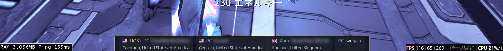
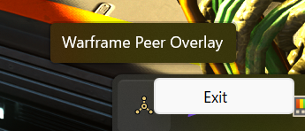

# Warframe Peer Overlay

Windows上でWarframeの分隊ピア情報を表示するオーバーレイです。

## 免責事項

**本ソフトウェアは無保証で提供されます。本ソフトウェアの使用または使用不能によって生じたいかなる損害・不利益・トラブルについても、作者は一切の責任を負いません。すべて自己責任でご利用ください。**

本プロジェクトは非公式であり、Digital Extremes Ltd. および Warframe とは一切関係がありません。同社から提携・承認・後援・支持を受けたものではありません。Warframe は Digital Extremes Ltd. の商標または登録商標です。

本ソフトウェアはゲームへの介入を行いません。Warframeが自ら出力するログファイル (`EE.log`) の読み取り、オーバーレイ位置合わせのためのウィンドウ位置の取得、ロードアウトを取得するためのゲームプロセスのメモリの読み取りを行います。メモリへのアクセスは読み取り専用で、ゲームクライアントの改変、メモリへの書き込み、プロセスへのインジェクション、通信の傍受はいずれも行いません。ただし、読み取り専用であってもゲームのメモリを読む行為を含め、利用がゲームの利用規約に抵触しないかについてはご自身でご判断ください。

## 機能

- `Warframe.x64.exe` / `Warframe.exe` の起動検出
- `%LOCALAPPDATA%\Warframe\EE.log` の追尾
- 分隊メンバー、接続先IP、ホスト候補の表示
- 国・地域・ASN表示と、リレー/VPNの可能性があるホスティングASNの表示
- 分隊メンバーと自分自身のロードアウト（フレームと武器、そのMOD・フォーマ・レベル、コンパニオン、ギアなど）のJSON保存。自分の分はアーセナルで装備を変えるたびに更新
- ロードアウトウィンドウ: 自分と分隊メンバーのロードアウトを1人1枚のカードで縦に並べて表示（名前・マスタリーランク・プラットフォーム・The New War / The Old Peace のクリア状況と、フレーム・プライマリ・セカンダリ・近接・コンパニオン）

[](assets/readme_overlay.png)

## 使い方

[Releases](https://github.com/synqark/warframe-peer-overlay/releases) から `warframe-peer-overlay.exe` をダウンロードして実行してください。インストールは不要です。

オーバーレイは常にゲーム入力を透過し、タスクバーには表示されません。releaseビルドではコマンドプロンプトも表示されません。終了するには、Windowsのタスクトレイにあるアイコンを右クリックし、`Exit` を選択してください。

ロードアウトウィンドウは、同じメニューの `Loadouts` で開きます。オーバーレイと違って通常のウィンドウなので、ゲームの外や別のモニタへ移動・リサイズできます。閉じても非表示になるだけで、次に開くと同じ位置に戻ります（アプリを終了すると位置は保持されません）。自分のカードは常に一番上に表示され、分隊メンバーのカードは参加すると加わり、抜けると消えます。


[](assets/readme_tray.png)


すでに起動している状態でもう一度exeを実行した場合、二重に起動せず、その旨をWindows通知で知らせて終了します。

## プライバシー

ログ解析とホスト判定はローカルで実行します。地域情報が有効な場合、検出した公開IPを `https://ipinfo.io` に問い合わせます。結果はユーザーのキャッシュディレクトリへ30日間保存します。EE.logやIPアドレスのログ出力、アップロードは行いません。

ロードアウトはゲームのメモリから読み取り、表示名・プラットフォームとともにJSONとして次の場所へ保存します。分隊メンバーの分は参加したときに1ファイルずつ、自分の分は装備が変わるたびに `self\` へ履歴として保存し、`self_latest.json` を最新版で上書きします。保存したファイルは外部へ送信しません。不要になったら削除してください。

```
%LOCALAPPDATA%\synqark\WarframePeerOverlay\data\loadouts\
```

外部問い合わせを行わない場合:

```powershell
warframe-peer-overlay.exe --no-geo
```

## ビルド

WindowsにRust 1.88以降をインストールし、PowerShellで実行します。アイテム名のデータ（[warframe-public-export-plus](https://github.com/calamity-inc/warframe-public-export-plus)）はサブモジュールなので、先に取得してください。

```powershell
git submodule update --init
cargo build --release
```

生成物: `target\release\warframe-peer-overlay.exe`

ゲームのアップデートでアイテム名のデータが古くなったら、サブモジュールを最新にしてからビルドし直します。

```powershell
git submodule update --remote
cargo build --release
```

## 制約

- Windows専用です。
- EE.logの形式はWarframe更新で変わる可能性があります。
- `HOST` はEE.logの `Squad host address` とピアIPが一致した場合のみ表示します。
- `Relay/VPN?` はASN名による推定であり、VPN利用を断定するものではありません。
- 分隊メンバーのロードアウトは、分隊への参加時にEE.logへ出るサイズの通知と一致するJSONをメモリから探して取得します。ゲームの更新で形式が変わると取得できなくなる可能性があります。
- オーバーレイの起動前に参加していたメンバーは、そのロードアウトがメモリに残っている場合のみ保存されます。
- 自分のロードアウトは、EE.logの `BuildLoadOut` をきっかけに、メモリ上で新しく作られた版を最新版として保存します。起動直後は、メモリ上で最も多く複製されている版を最新版とみなします。
- ロードアウトウィンドウのアイテム名は、ビルド時に埋め込んだ warframe-public-export-plus の日本語データから引きます。データにない名前（データの更新前に出た新しいアイテムなど）は、ゲーム内部のパスの末尾（内部名）で表示します。マウスを重ねると、完全なパス・モジュラー武器のパーツ・ランク・フォーマ数を表示します。
- Windows通知は、インストーラを持たないexeのためアプリ登録がなく、`Windows PowerShell` の名前とアイコンで表示されます。

## ライセンス

[The Unlicense](LICENSE) — パブリックドメインに献呈しています。著作権表示なしで、商用・非商用を問わず自由に利用、改変、再配布できます。

ただし、サブモジュール `third_party/warframe-public-export-plus` と、そこからビルド時にexeへ埋め込むアイテム名のデータはWarframe由来のもので、このライセンスの対象外です。
